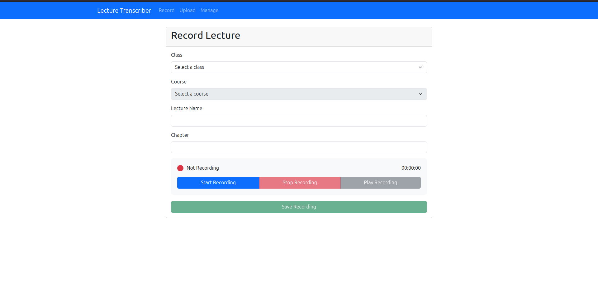
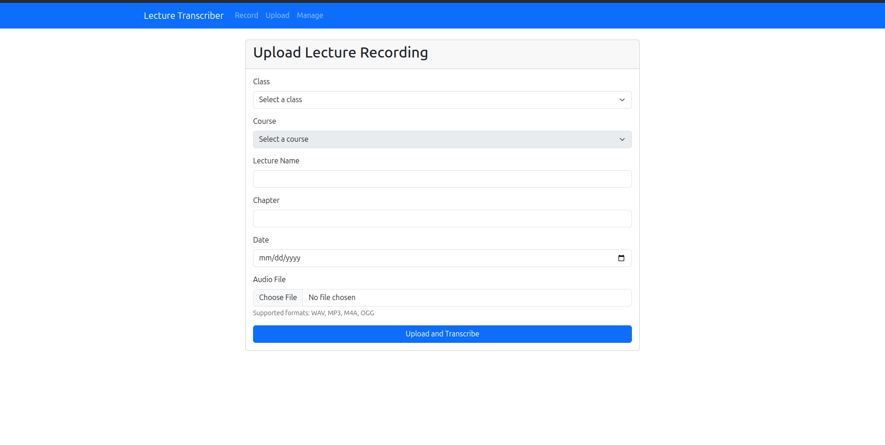
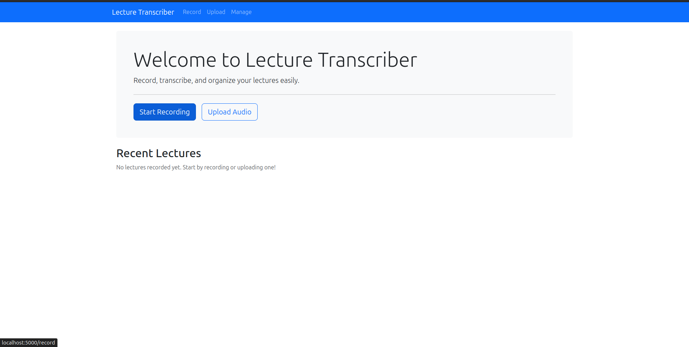

---

# Lecture Recording and Transcription App

This project is a **Lecture Recording and Transcription App** that allows users to record or upload audio lectures, assign them to courses and classes, and generate transcriptions using the **Vosk Speech Recognition** engine. The app also includes a feature to read and listen to transcriptions simultaneously.

---

## **Features**
- Add and manage **Classes**, **Courses**, and **Lectures**.
- Record or upload audio files for lectures.
- Generate transcriptions of audio files using the **Vosk Model**.
- View transcriptions while listening to the audio.
- Mobile-responsive interface with a user-friendly UI.

---

## **Prerequisites**
1. **Python 3.8 or higher**.
2. **FFmpeg installed** on your system (for audio processing).
3. **Vosk Speech Recognition Model**:
   - Download the model `vosk-model-small-en-us-0.15` from [Vosk Models](https://alphacephei.com/vosk/models).
   - Extract the contents and place them in the `model/` folder in the root of the project( if the model folder is not present create it in the root of the project) .

### **Installing FFmpeg**
FFmpeg for Conversion: The project uses FFmpeg to convert the WebM file to WAV. This is much more reliable for handling various audio codecs that might be inside the WebM container.

#### On **Windows**:
1. Download FFmpeg from the official site: [FFmpeg Download Page](https://ffmpeg.org/download.html).
2. Extract the contents of the zip file.
3. Add the FFmpeg `bin` directory to your system's `PATH`:
   - Go to **Control Panel > System > Advanced system settings > Environment Variables**.
   - Under **System Variables**, select `Path` and click **Edit**.
   - Add the path to the `bin` directory (e.g., `C:\ffmpeg\bin`).
   - make sure ffmpeg is present in your virtual environment.
4. Verify installation:
   ```bash
   ffmpeg -version
   ```

#### On **Linux**:
1. Install FFmpeg using your package manager:
   ```bash
   sudo apt update
   sudo apt install ffmpeg
   ```
2. Verify installation:
   ```bash
   ffmpeg -version
   ```

---

## **Setup Instructions**

### Step 1: Clone the Project
```bash
git clone https://github.com/YoungWinny/lectrans.git
cd lecture_transcriber_main
```

### Step 2: Set Up Virtual Environment
Create and activate a virtual environment:
```bash
python -m venv venv
# On Linux/Mac:
source venv/bin/activate
# On Windows:
venv\Scripts\activate
```

### Step 3: Install Dependencies
Install the required Python packages:
```bash
pip install -r requirements.txt
```

### Step 4: Add the Vosk Model
- Download the model `vosk-model-small-en-us-0.15` from [Vosk Models](https://alphacephei.com/vosk/models).
- Extract the contents and move them to the `model/` directory in the root of the project.

### Step 5: Run the Application
Start the Flask development server:
```bash
python run.py
```

Access the app at `http://127.0.0.1:5000/`.

---

## **Web Interfaces**

Here are images for the different interfaces:

### **1. Record**


---

### **2. Upload**


---

### **3. Manage**



## **License**
This project is licensed under the **Apache License 2.0**. See the `LICENSE` file for more details.

---

## **Contributing**
Contributions are welcome! Fork the repository, make your changes, and submit a pull request.
